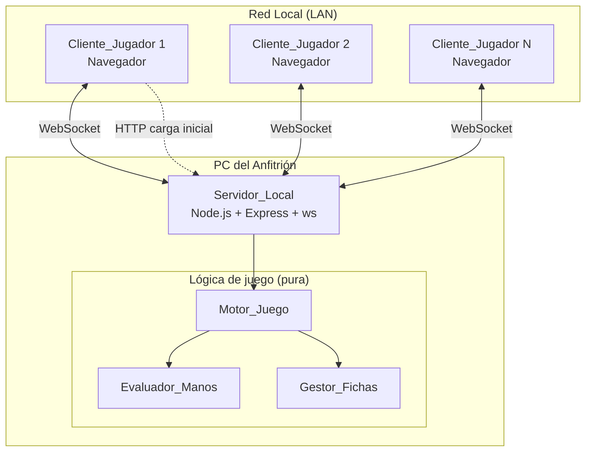
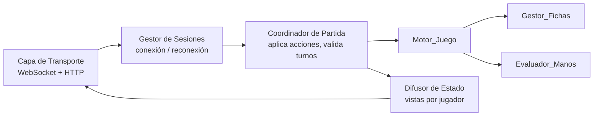
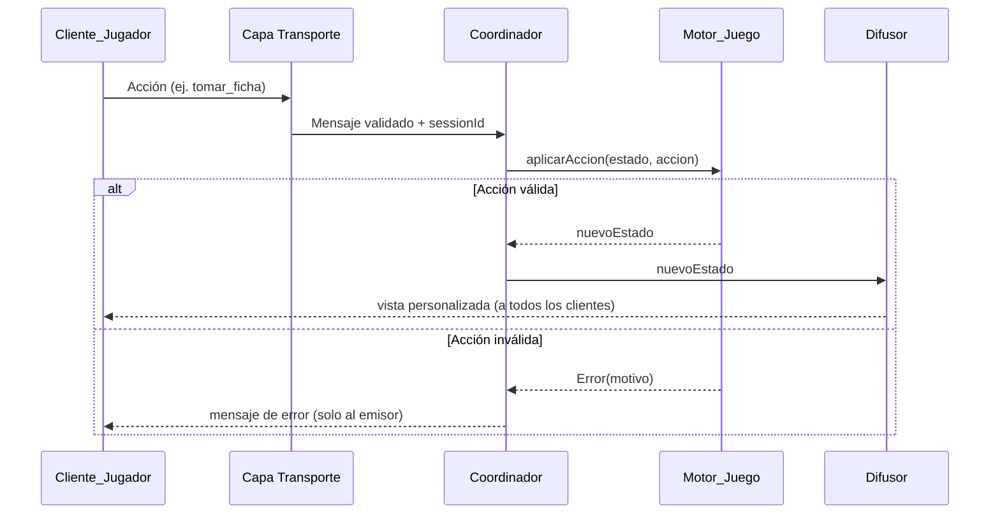
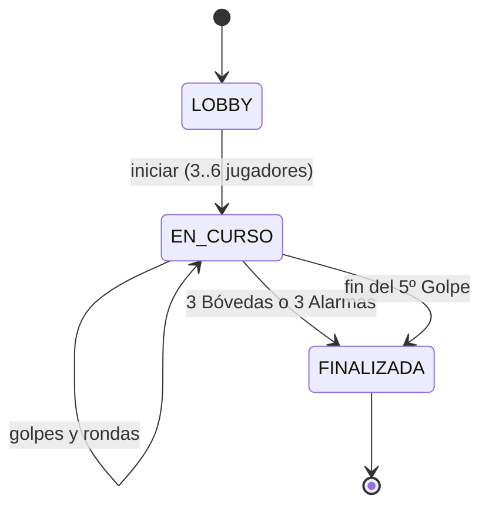

# Documento de Diseño

## Overview

Este documento describe el diseño técnico de **The Gang**, una aplicación web para jugar la versión cooperativa de póker en una red local (LAN). El **Anfitrión** ejecuta un **Servidor_Local** en su PC y sus compañeros se conectan desde un navegador en la misma red. La aplicación implementa el **Modo Básico** para 3 a 6 jugadores, con toda la interfaz en español y temática de "grupo de ladrones profesionales".

### Objetivos de diseño

- **Cero dependencias en la nube**: todo corre en la PC del Anfitrión. Los clientes solo necesitan un navegador y estar en la misma LAN.
- **Estado autoritativo en el servidor**: el Servidor_Local es la única fuente de verdad sobre el estado de la Partida. Los clientes nunca calculan resultados de juego; solo renderizan estado y envían intenciones (acciones).
- **Sincronización en tiempo real**: se usan **WebSockets** para enviar actualizaciones de estado a todos los clientes y recibir acciones de los jugadores con baja latencia.
- **Privacidad de la información**: las Cartas de Bolsillo de un Jugador solo se envían a su propio cliente hasta el Showdown. El servidor nunca filtra cartas privadas a otros clientes.
- **Lógica de juego pura y testeable**: el Motor_Juego, el Evaluador_Manos y el Gestor_Fichas se implementan como módulos de lógica pura (sin I/O), lo que permite pruebas basadas en propiedades (PBT) exhaustivas.

### Decisiones tecnológicas y su justificación

| Decisión | Elección | Justificación |
|----------|----------|---------------|
| Lenguaje/runtime | **Node.js + TypeScript** | El usuario es desarrollador en Windows; Node.js se instala fácilmente, no requiere compilación nativa y TypeScript aporta seguridad de tipos al modelar el estado de la partida y las cartas. |
| Servidor HTTP | **Express** | Sirve los archivos estáticos del cliente y un par de endpoints de salud/descubrimiento de forma minimalista. |
| Tiempo real | **ws** (WebSocket nativo de Node) | Biblioteca ligera, sin overhead de Socket.IO. La LAN es fiable; no se necesitan fallbacks a long-polling. |
| Cliente | **HTML + TypeScript + Vite** (SPA ligera, sin framework pesado obligatorio) | Mantiene el bundle pequeño y la curva simple. Se puede usar un micro-framework de vistas, pero el estado vive en el servidor, así que el cliente es principalmente una vista reactiva del estado recibido. |
| Pruebas | **Vitest + fast-check** | Vitest se integra con el toolchain de Vite/TS; fast-check es la biblioteca estándar de property-based testing en el ecosistema JS/TS. |
| Empaquetado | Script `npm start` que arranca el servidor | El Anfitrión ejecuta un único comando. Opcionalmente se puede empaquetar con `pkg` en un `.exe`, pero queda fuera del alcance inicial. |

> Nota de seguridad: el servidor está pensado para una LAN de confianza (oficina). No incluye autenticación fuerte; la identidad del jugador se basa en su nombre registrado más un token de sesión. Esto es aceptable para el contexto LAN, pero se documenta explícitamente como una limitación: cualquier persona en la red puede conectarse.

## Architecture

### Vista de despliegue



### Capas del servidor



La arquitectura separa claramente tres responsabilidades, lo que satisface la mantenibilidad y permite testear la lógica de juego sin sockets:

1. **Capa de Transporte (impura)**: gestiona conexiones WebSocket, sirve la SPA por HTTP, serializa/deserializa mensajes JSON.
2. **Coordinador de Partida (orquestación)**: recibe acciones validadas, las aplica al estado mediante el Motor_Juego, y decide qué vista del estado enviar a cada cliente (filtrando información privada).
3. **Lógica de juego (pura)**: Motor_Juego, Evaluador_Manos y Gestor_Fichas son funciones puras que reciben un estado y una acción y devuelven un nuevo estado o un error. No conocen WebSockets ni HTTP.

### Modelo de actualización de estado (event sourcing ligero)

El flujo de una acción de jugador sigue este ciclo:



El estado es autoritativo y se reemplaza de forma inmutable: `aplicarAccion` nunca muta el estado anterior, lo que facilita el testing y el razonamiento sobre confluencia.

## Components and Interfaces

### Servidor_Local (Capa de Transporte + Coordinador)

Responsabilidades:
- Arrancar un servidor HTTP que sirva la SPA y publique la dirección de acceso LAN (criterios 1.1, 1.2, 1.3).
- Aceptar conexiones WebSocket y asociarlas a sesiones de jugador.
- Garantizar como máximo una Partida activa (criterios 1.4, 1.5).
- Gestionar desconexión/reconexión preservando el estado del jugador (criterios 1.6, 1.7, 1.8).
- Difundir vistas de estado filtradas por jugador (privacidad: criterios 4.2, 4.6, 10.x).

Interfaz (TypeScript):

```typescript
interface ServidorLocal {
  iniciar(puerto: number): Promise<DireccionAcceso>; // devuelve URL LAN publicada
  detener(): Promise<void>;
}

interface DireccionAcceso {
  url: string;          // ej. http://192.168.1.42:3000
  ipLan: string;
  puerto: number;
}

interface SesionJugador {
  sessionId: string;    // token opaco para reconexión
  nombre: string;       // nombre registrado, único en la partida
  conectado: boolean;
  socket: WebSocket | null;
}
```

### Cliente_Jugador

- SPA en español que renderiza el estado recibido del servidor.
- Envía acciones (unirse, tomar/intercambiar ficha, avanzar) como mensajes WebSocket.
- Muestra de forma permanente el recordatorio de no revelar cartas ni hacer bluff (criterio 10.2) y nunca ofrece UI para comunicar cartas (criterio 10.1).
- Permite consultar el Ranking_de_Manos (criterio 11.3).
- No contiene lógica de reglas: solo presentación e intención.

### Motor_Juego

Controla el flujo de Partida → Golpes → Rondas → Showdown y aplica las reglas.

```typescript
interface MotorJuego {
  iniciarPartida(jugadores: Jugador[], semilla: Semilla): EstadoPartida;
  aplicarAccion(estado: EstadoPartida, accion: Accion): ResultadoAccion;
  // avanza ronda / inicia showdown según condiciones de fichas completas
}

type ResultadoAccion =
  | { ok: true; estado: EstadoPartida; eventos: EventoJuego[] }
  | { ok: false; error: ErrorJuego };
```

Reglas clave que implementa:
- Estructura de cuatro Rondas por Golpe y máximo cinco Golpes (criterios 3.1–3.7).
- Reparto de cartas privadas y revelado de comunitarias (criterios 4.1, 4.3, 4.4, 4.5).
- Avance de ronda cuando todos tienen ficha del color activo (criterios 3.3, 3.4, 6.8).
- Resolución del Showdown comparando orden de fichas rojas con fuerza real (criterios 8.1–8.7).
- Condiciones de fin de partida con tres Bóvedas o tres Alarmas (criterios 9.1–9.4).

### Evaluador_Manos

Componente puro que evalúa la mejor mano de 5 cartas entre las 7 disponibles.

```typescript
interface EvaluadorManos {
  // Evalúa la mejor combinación de 5 entre las 7 cartas. Lanza/retorna error si faltan cartas.
  evaluar(bolsillo: [Carta, Carta], comunitarias: Carta[]): ResultadoEvaluacion;
  // Compara dos manos ya evaluadas. <0, 0, >0.
  comparar(a: ManoEvaluada, b: ManoEvaluada): number;
  // True si son exactamente iguales en categoría y valores (Empate_Verdadero).
  esEmpateVerdadero(a: ManoEvaluada, b: ManoEvaluada): boolean;
}

type ResultadoEvaluacion =
  | { ok: true; mano: ManoEvaluada }
  | { ok: false; motivo: 'CARTAS_INSUFICIENTES' };

interface ManoEvaluada {
  categoria: CategoriaMano;       // enum 0..9
  cartasOrdenadas: Carta[];       // las 5 cartas que forman la mano, ordenadas para comparación
  ranks: number[];                // vector de desempate descendente (categoría + kickers)
}
```

Detalles de evaluación:
- Genera las C(7,5) = 21 combinaciones de cinco cartas y selecciona la de mayor fuerza (criterio 7.1).
- Clasifica en una de las diez categorías del Ranking_de_Manos (criterio 7.2).
- Desempata por valores de la categoría y luego kickers descendentes; el As es alto salvo en la escalera A-2-3-4-5 donde vale 1 (criterio 7.3).
- Detecta Empate_Verdadero cuando categoría y vector de desempate coinciden exactamente (criterio 7.4).
- Devuelve error si faltan cartas (criterio 7.5).

### Gestor_Fichas

Componente puro que administra disponibilidad, toma e intercambio de fichas.

```typescript
interface GestorFichas {
  prepararFichas(numJugadores: number): EstadoFichas; // retira fichas con estrellas > N
  fichasDisponibles(estado: EstadoFichas, color: ColorFicha): Ficha[];
  tomar(estado: EstadoFichas, jugadorId: string, ficha: Ficha): ResultadoFichas;
  intercambiarConCentro(estado: EstadoFichas, jugadorId: string, fichaCentro: Ficha): ResultadoFichas;
  intercambiarConJugador(estado: EstadoFichas, jugadorA: string, jugadorB: string, color: ColorFicha): ResultadoFichas;
  todosTienenFichaDelColor(estado: EstadoFichas, color: ColorFicha, jugadores: string[]): boolean;
}

type ResultadoFichas =
  | { ok: true; estado: EstadoFichas }
  | { ok: false; error: ErrorJuego };
```

Reglas clave:
- Retira fichas con valor de estrellas superior a N (criterio 5.1) y expone valores 1..N por color (criterios 5.2, 5.3).
- Solo el color de la Ronda activa está disponible (criterios 5.4, 5.5).
- Un jugador no puede poseer dos fichas del mismo color (criterios 6.1, 6.2).
- Intercambios con centro y con otro jugador conservan invariantes (criterios 6.3, 6.4, 6.5, 6.7).

## Data Models

### Carta

```typescript
type Palo = 'PICAS' | 'CORAZONES' | 'DIAMANTES' | 'TREBOLES';
// Valor: 2..14 (11=J, 12=Q, 13=K, 14=A). El As puede valer 1 solo en la escalera A-2-3-4-5.
interface Carta {
  valor: number; // 2..14
  palo: Palo;
}
// La baraja completa son exactamente 52 cartas distintas.
```

### Ficha

```typescript
type ColorFicha = 'BLANCO' | 'AMARILLO' | 'NARANJA' | 'ROJO';
interface Ficha {
  color: ColorFicha;   // corresponde a la Ronda
  estrellas: number;   // 1..N
}
```

### Categoría de mano

```typescript
enum CategoriaMano {
  CARTA_ALTA = 0,
  PAR = 1,
  DOS_PARES = 2,
  TRIO = 3,
  ESCALERA = 4,
  FULL_HOUSE = 5,   // Full House
  POKER = 6,        // Four of a Kind
  COLOR = 7,        // Flush
  ESCALERA_COLOR = 8,
  ESCALERA_REAL = 9
}
```

> Nota: en The Gang el orden de manos sitúa Full House < Póker < Color, que difiere del póker tradicional (donde Color < Full House < Póker). El diseño respeta el Ranking_de_Manos definido en los requisitos (criterio 7.2 y glosario), modelando el enum exactamente en ese orden de menor a mayor.

### Estado de fichas

```typescript
interface EstadoFichas {
  numJugadores: number;                       // N, 3..6
  centro: Ficha[];                            // fichas disponibles en el centro
  porJugador: Record<string, Ficha[]>;        // fichas en posesión de cada jugador
  colorActivo: ColorFicha;                    // color de la Ronda activa
}
```

### Estado de partida



```typescript
type FasePartida = 'LOBBY' | 'EN_CURSO' | 'FINALIZADA';
type Ronda = 'PRE_FLOP' | 'FLOP' | 'TURN' | 'RIVER' | 'SHOWDOWN';

interface Jugador {
  id: string;
  nombre: string;        // 1..20 chars, único
  bolsillo: [Carta, Carta] | null;
}

interface EstadoGolpe {
  numero: number;            // 1..5
  ronda: Ronda;
  baraja: Carta[];           // cartas restantes (mazo) tras barajar
  comunitarias: Carta[];     // 0..5 reveladas
  fichas: EstadoFichas;
}

interface EstadoPartida {
  fase: FasePartida;
  jugadores: Jugador[];      // 3..6
  golpeActual: EstadoGolpe | null;
  golpesJugados: number;     // 0..5
  bovedasDoradas: number;    // 0..3
  alarmasRojas: number;      // 0..3 (2 en Modo Ladrón Maestro, futuro)
  resultado: 'VICTORIA' | 'DERROTA' | null;
  semilla: Semilla;          // para barajado determinista y reproducible en tests
}
```

### Modelo de showdown

```typescript
interface PosicionShowdown {
  jugadorId: string;
  estrellasRojas: number;     // 1..N, orden ascendente
  mano: ManoEvaluada;
}

interface ResultadoShowdown {
  orden: PosicionShowdown[];  // ascendente por ficha roja
  exito: boolean;
  // detalle de la primera violación de orden si hubo fracaso
  violacion: { anterior: string; posterior: string } | null;
}
```

## Correctness Properties

*Una propiedad es una característica o comportamiento que debe cumplirse en todas las ejecuciones válidas de un sistema; esencialmente, un enunciado formal sobre lo que el sistema debe hacer. Las propiedades sirven de puente entre las especificaciones legibles por humanos y las garantías de correctitud verificables por máquina.*

Las propiedades se concentran en la lógica pura (Evaluador_Manos, Gestor_Fichas, Motor_Juego y Showdown), donde el comportamiento varía de forma significativa con la entrada y donde 100+ iteraciones revelan casos límite. Los requisitos de infraestructura (arranque del servidor, difusión temporal, servir la SPA) se cubren con pruebas de integración/smoke y no como propiedades (ver Testing Strategy).

### Property 1: No repetición y conteo correcto de cartas

*Para cualquier* semilla de barajado y cualquier número de jugadores N entre 3 y 6, tras repartir las Cartas de Bolsillo y revelar las Cartas Comunitarias de cada Ronda, todas las cartas en juego (bolsillos + comunitarias + mazo restante) son distintas entre sí, pertenecen a la baraja de 52, cada Jugador tiene exactamente 2 Cartas de Bolsillo, y el número de Cartas Comunitarias es 3 tras el Flop, 4 tras el Turn y 5 tras el River.

**Validates: Requirements 4.1, 4.3, 4.4, 4.5**

### Property 2: Privacidad de las Cartas de Bolsillo antes del Showdown

*Para cualquier* estado de Partida cuyo Golpe no ha llegado al Showdown y cualquier par de Jugadores distintos A y B, la vista de estado que el Servidor_Local envía al Cliente de A no contiene las Cartas de Bolsillo de B.

**Validates: Requirements 4.2, 4.6**

### Property 3: Revelado de bolsillos en el Showdown

*Para cualquier* estado de Partida en fase de Showdown, la vista de estado que el Servidor_Local envía a cualquier Jugador contiene las Cartas de Bolsillo de todos los Jugadores de la Partida.

**Validates: Requirements 10.3**

### Property 4: Reconexión preserva y restaura el estado del Jugador (round trip)

*Para cualquier* Partida activa y cualquier Jugador, desconectar a ese Jugador y volver a conectarlo con su nombre registrado restaura un estado equivalente para ese Jugador (sus mismas Cartas de Bolsillo, sus mismas Fichas, y la misma Ronda y Golpe en curso) sin alterar el estado autoritativo de la Partida.

**Validates: Requirements 1.6, 1.7**

### Property 5: Registro de Jugador con nombre válido

*Para cualquier* nombre válido (cadena no vacía, longitud entre 1 y 20, no usada por otro Jugador) y cualquier Partida en LOBBY con menos de 6 Jugadores, registrar al Jugador produce una lista que contiene exactamente un Jugador adicional con ese nombre.

**Validates: Requirements 2.1**

### Property 6: Rechazo de registro inválido conserva la lista

*Para cualquier* Partida y cualquier nombre inválido (vacío, compuesto solo de espacios, de más de 20 caracteres, duplicado) o cualquier intento de registro cuando ya hay 6 Jugadores, el intento de registro es rechazado y la lista de Jugadores permanece exactamente igual.

**Validates: Requirements 2.2, 2.3**

### Property 7: Inicio de Partida y secuencia de Rondas

*Para cualquier* N entre 3 y 6 Jugadores, iniciar la Partida produce el Golpe número 1 en la Ronda Pre-Flop, y avanzar sucesivamente recorre las Rondas en el orden exacto Pre-Flop → Flop → Turn → River → Showdown.

**Validates: Requirements 3.1, 3.2**

### Property 8: Avance de Ronda condicionado a Fichas completas

*Para cualquier* estado de Golpe, el Motor_Juego habilita el avance (a la siguiente Ronda si no es River, o al Showdown si es River) si y solo si todos los Jugadores poseen exactamente una Ficha del color de la Ronda activa.

**Validates: Requirements 3.3, 3.4, 6.8**

### Property 9: Encadenamiento de Golpes acotado a cinco

*Para cualquier* secuencia de Golpes resueltos sin que se cumpla una condición de fin de Partida, mientras se hayan jugado menos de cinco Golpes el siguiente Golpe inicia en Pre-Flop con número incrementado en uno, y en ningún momento el número de Golpes jugados excede cinco.

**Validates: Requirements 3.5, 3.6**

### Property 10: Preparación de Fichas según el número de Jugadores

*Para cualquier* N entre 3 y 6, preparar las Fichas no produce ninguna Ficha con valor de estrellas superior a N en ninguno de los cuatro colores, y existe exactamente una Ficha por cada valor de estrellas entre 1 y N para cada color.

**Validates: Requirements 5.1, 5.2**

### Property 11: Invariante de conservación de Fichas

*Para cualquier* estado de Fichas alcanzable, cada combinación (color, estrella) válida aparece exactamente una vez en total entre las Fichas del centro y las Fichas en posesión de los Jugadores, las Fichas disponibles de un color distinto al color activo son el conjunto vacío, y ningún Jugador posee dos Fichas del mismo color.

**Validates: Requirements 5.3, 5.4**

### Property 12: Acciones de Fichas inválidas conservan el estado

*Para cualquier* estado de Fichas y cualquier acción inválida (tomar una Ficha de estrellas superior a N, tomar una Ficha de color no activo, tomar una Ficha de un color del que ya se posee otra, o intercambiar con una Ficha que no está disponible o que el otro Jugador ya no posee), la acción es rechazada y el estado de Fichas permanece exactamente igual.

**Validates: Requirements 5.5, 6.2, 6.5**

### Property 13: Toma de Ficha transfiere del centro al Jugador

*Para cualquier* estado donde una Ficha del color activo está disponible en el centro y el Jugador no posee ya una Ficha de ese color, tomar esa Ficha la retira del centro y la añade a la posesión del Jugador, conservando el conteo total de Fichas.

**Validates: Requirements 6.1**

### Property 14: Intercambio de Fichas conserva la cardinalidad y permuta poseedores

*Para cualquier* estado de Fichas: (a) un intercambio válido del Jugador con una Ficha del centro deja al Jugador en posesión de la Ficha del centro y devuelve su Ficha previa al centro; (b) un intercambio válido entre dos Jugadores hace que cada uno quede con la Ficha que antes tenía el otro. En ambos casos el multiconjunto total de Fichas (centro + posesiones) permanece invariante.

**Validates: Requirements 6.3, 6.4**

### Property 15: Las Fichas no se transfieren a otro Jugador salvo por intercambio

*Para cualquier* estado y cualquier acción que no sea un intercambio válido conforme a las reglas, el conjunto de Fichas en posesión de cualquier Jugador distinto del que actúa no aumenta.

**Validates: Requirements 6.7**

### Property 16: El Evaluador_Manos elige la mejor combinación de cinco entre siete

*Para cualquier* conjunto de 7 cartas distintas (2 de bolsillo + 5 comunitarias), la mano de cinco cartas devuelta por el Evaluador_Manos tiene una fuerza mayor o igual que la de cualquiera de las 21 combinaciones posibles de cinco cartas entre esas siete.

**Validates: Requirements 7.1**

### Property 17: Clasificación correcta de categoría (model-based)

*Para cualquier* conjunto de 7 cartas distintas, la categoría del Ranking_de_Manos asignada por el Evaluador_Manos coincide con la categoría determinada por un evaluador de referencia independiente y sencillo.

**Validates: Requirements 7.2**

### Property 18: El comparador es total y consistente con el desempate

*Para cualquier* par o terna de manos evaluadas, la función de comparación es total y consistente (antisimétrica y transitiva), ordena primero por categoría y luego por los valores de las cartas que la forman seguidos de los kickers en orden descendente, y trata la escalera A-2-3-4-5 como la escalera de menor valor (el As cuenta como 1 únicamente en esa escalera).

**Validates: Requirements 7.3**

### Property 19: Empate Verdadero equivale a comparación nula

*Para cualquier* par de manos evaluadas A y B, A y B forman un Empate_Verdadero si y solo si la comparación entre A y B es de igualdad (misma categoría y mismos valores de cartas).

**Validates: Requirements 7.4**

### Property 20: Evaluación con cartas insuficientes produce error

*Para cualquier* entrada en la que falten Cartas de Bolsillo o no estén disponibles las cinco Cartas Comunitarias, el Evaluador_Manos no produce clasificación y devuelve un error de cartas insuficientes.

**Validates: Requirements 7.5**

### Property 21: Orden del Showdown es una biyección ascendente

*Para cualquier* asignación de Fichas rojas a los Jugadores (una permutación de los valores 1 a N), el orden del Showdown contiene exactamente N posiciones, es estrictamente ascendente por valor de estrellas de la Ficha roja, y asigna a cada Jugador exactamente una posición.

**Validates: Requirements 8.1, 8.2**

### Property 22: Éxito del Golpe equivale a fuerza no decreciente en el orden

*Para cualquier* conjunto de manos de los Jugadores ordenadas según el valor ascendente de sus Fichas rojas, el Golpe se declara exitoso si y solo si la secuencia de fuerzas de las manos en ese orden es no decreciente según el comparador del Evaluador_Manos; en caso contrario se declara fracasado.

**Validates: Requirements 8.3, 8.4**

### Property 23: Los Empates Verdaderos entre consecutivos no causan fracaso

*Para cualquier* orden de Showdown en el que dos o más Jugadores consecutivos forman un Empate_Verdadero, el orden relativo de sus Fichas rojas entre ellos no afecta el resultado del Golpe; la condición de éxito o fracaso depende únicamente de su fuerza respecto a los Jugadores no empatados que los preceden y los siguen.

**Validates: Requirements 8.5**

### Property 24: El resultado del Golpe actualiza Bóvedas o Alarmas en exactamente uno

*Para cualquier* estado de Partida, declarar un Golpe exitoso incrementa el número de Bóvedas en su lado dorado en exactamente uno, y declarar un Golpe fracasado incrementa el número de Alarmas en su lado rojo en exactamente uno; la otra cuenta permanece sin cambios.

**Validates: Requirements 8.6, 8.7**

### Property 25: Condiciones de fin de Partida

*Para cualquier* estado de Partida, si el número de Bóvedas doradas alcanza tres entonces la Partida finaliza con resultado de victoria, y si el número de Alarmas rojas alcanza tres entonces la Partida finaliza con resultado de derrota.

**Validates: Requirements 9.1, 9.2**

### Property 26: El estado finalizado es estable

*Para cualquier* estado de Partida en fase FINALIZADA y cualquier acción posterior, el resultado final y la fase permanecen sin cambios y no se inicia ningún Golpe nuevo.

**Validates: Requirements 9.4**

## Error Handling

El servidor distingue dos clases de fallo y nunca filtra información privada en los mensajes de error.

### Errores de juego (acciones inválidas)

Provienen de la lógica pura como un resultado `{ ok: false, error }`. El Coordinador los devuelve **solo al Cliente emisor** sin modificar el estado autoritativo. El estado compartido nunca cambia ante una acción inválida (ver Property 12, 6, 26).

```typescript
type CodigoError =
  | 'NOMBRE_INVALIDO'          // 2.2
  | 'PARTIDA_COMPLETA'         // 2.3
  | 'JUGADORES_INSUFICIENTES'  // 2.4
  | 'PARTIDA_EN_CURSO'         // 1.5
  | 'PARTIDA_FINALIZADA'       // 1.8
  | 'FICHA_NO_DISPONIBLE'      // 5.5, 6.5
  | 'FICHA_COLOR_DUPLICADO'    // 6.2
  | 'FICHA_FUERA_DE_RANGO'     // 5.5
  | 'ACCION_NO_PERMITIDA'      // 4.7, 10.4 (solicitar cartas ajenas)
  | 'CARTAS_INSUFICIENTES';    // 7.5

interface ErrorJuego {
  codigo: CodigoError;
  mensaje: string; // texto en español, temático, sin revelar datos privados
}
```

Regla de privacidad en errores: cuando un Cliente solicita Cartas de Bolsillo ajenas antes del Showdown, la respuesta es un `ACCION_NO_PERMITIDA` que **no incluye** el valor de las cartas (criterios 4.7, 10.4).

### Errores de transporte e infraestructura

- **Desconexión de Cliente**: el Coordinador marca la sesión como desconectada pero conserva el estado del Jugador mientras la Partida siga activa (criterio 1.6). No se elimina al Jugador del Golpe en curso.
- **Reconexión**: al recibir una nueva conexión con un `sessionId`/nombre conocido y Partida activa, se reasocia el socket y se envía el estado completo personalizado (criterio 1.7). Si la Partida ya finalizó, se responde `PARTIDA_FINALIZADA` (criterio 1.8).
- **Mensajes malformados**: un mensaje JSON inválido o de tipo desconocido se ignora y se responde un error genérico al emisor, sin afectar el estado.
- **Puerto ocupado al arrancar**: el Servidor_Local informa al Anfitrión y sugiere otro puerto; no arranca una Partida hasta escuchar correctamente (criterio 1.1).
- **Caída del Servidor_Local**: como el estado vive en memoria del proceso del Anfitrión, una caída termina la Partida. Se documenta como limitación del alcance LAN inicial (sin persistencia en disco).

## Testing Strategy

### Enfoque dual

Se combinan pruebas basadas en propiedades (PBT) para la lógica pura y pruebas por ejemplo/integración para casos concretos, bordes e infraestructura. Las pruebas unitarias por ejemplo cubren bugs concretos; las pruebas de propiedades verifican la correctitud general sobre un amplio espacio de entradas.

### Pruebas basadas en propiedades (fast-check + Vitest)

Aplican a Evaluador_Manos, Gestor_Fichas, Motor_Juego y resolución del Showdown, que son funciones puras con propiedades universales claras. Cada propiedad del documento se implementa con **una única** prueba de propiedad.

Requisitos de configuración:
- Biblioteca: **fast-check** (no se implementa PBT desde cero).
- Mínimo **100 iteraciones** por prueba de propiedad (`{ numRuns: 100 }` o superior).
- Cada prueba se etiqueta con un comentario que referencia la propiedad del diseño con el formato:
  `// Feature: the-gang-game, Property {número}: {texto de la propiedad}`
- Generadores personalizados:
  - `genCarta` / `genBaraja` / `gen7Cartas`: cartas y manos sin repetición; deben incluir casos límite como la escalera A-2-3-4-5 (la rueda), colores, y manos con múltiples categorías candidatas.
  - `genN`: número de jugadores entre 3 y 6.
  - `genEstadoFichas`: estados de fichas alcanzables, incluyendo centro parcialmente vaciado y posesiones variadas.
  - `genNombre`: nombres válidos e inválidos (vacío, solo espacios, >20, duplicados, Unicode).
  - `genAsignacionRojas`: permutaciones de valores 1..N para fichas rojas.
- Para Property 17 (clasificación correcta) se usa **model-based testing**: un evaluador de referencia simple e independiente del de producción sirve de oráculo.
- Las propiedades de privacidad (Property 2, 3) usan la función de proyección de vista por jugador; no requieren WebSockets reales.

Mapa de cobertura de propiedades:
- Cartas y reparto: Property 1
- Privacidad/revelado: Property 2, 3
- Reconexión: Property 4
- Lobby/registro: Property 5, 6
- Flujo de Golpes/Rondas: Property 7, 8, 9
- Gestor_Fichas: Property 10, 11, 12, 13, 14, 15
- Evaluador_Manos: Property 16, 17, 18, 19, 20
- Showdown y fin de Partida: Property 21, 22, 23, 24, 25, 26

### Pruebas por ejemplo (unitarias)

Cubren criterios clasificados como EXAMPLE/EDGE_CASE en el prework:
- Una sola Partida activa y rechazo de la segunda (1.4, 1.5).
- Rechazo de reincorporación a Partida finalizada (1.8).
- Inicio impedido con menos de 3 Jugadores: casos 0, 1, 2 (2.4).
- Lista visible en LOBBY (2.5).
- Finalización exacta tras el quinto Golpe sin condición de fin (3.7).
- Rechazo de solicitud de cartas ajenas sin revelar valor (4.7, 10.4).
- Ausencia de acciones para comunicar cartas y de chat libre (10.1, 10.5).
- Recordatorio permanente de no revelar/no bluff (10.2).
- Idioma español y términos del glosario en textos clave (11.1, 11.2).
- Ranking de manos en orden al solicitarlo (11.3).
- Modo Básico por defecto: 3 Alarmas, sin cartas de desafío (12.5).
- Manos canónicas de póker como casos concretos del Evaluador (escalera real, full house vs color según el ranking de The Gang, rueda A-2-3-4-5, empate verdadero).

### Pruebas de integración y smoke

Cubren criterios INTEGRATION/SMOKE (infraestructura y tiempo real), no aptos para PBT:
- Smoke: el Servidor_Local arranca y escucha en una dirección LAN dentro del límite de tiempo, y publica la URL (1.1, 1.2).
- Integración: una petición HTTP recibe la SPA en español (1.3).
- Integración: un cambio en la lista de Jugadores, en las Fichas o el resultado final dispara un broadcast a los Clientes conectados (2.6, 6.6, 9.3).
- Integración end-to-end (1-3 ejemplos): dos o tres Clientes WebSocket simulan un Golpe completo (unirse → tomar fichas por ronda → showdown) y verifican la sincronización de estado.

### Justificación de exclusiones de PBT

No se aplican propiedades a: arranque del servidor, servir archivos estáticos, latencia de difusión, presencia de textos en español y ausencia de chat. Estos comportamientos no varían de forma significativa con la entrada y/o dependen de infraestructura externa (red, navegador), por lo que 100 iteraciones no aportarían más valor que 1–3 ejemplos representativos.
